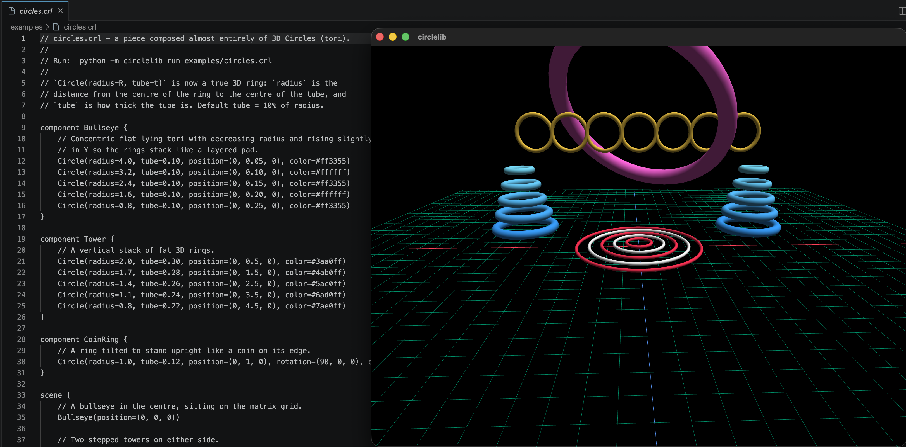

# circlelib

> **3D scenes as code — modules, components, and animations in a small modern language.**



`circlelib` is a tiny custom language for declaring 3D scenes. You write
a `.crl` file describing primitives, components, and imports; you run it;
a black window opens with a glowing Matrix-style grid for orientation,
your scene is rendered, and an orbit camera lets you look around with the
mouse.

```sh
$ circlelib run examples/circles.crl
```

It is somewhere between a graphics library and a small programming
language. It has its own syntax, parser, AST, module system, and a
runtime that turns the AST into a 3D scene rendered with OpenGL.

---

## Why circlelib

- **Modules and components, not just a flat script.** Define `component
  Car { ... }` once, drop it into a scene with `Car(position=(0, 0, 0))`,
  and import it across files with `import "modules/wheels" as wheels`.
- **Modern argument syntax.** Every call uses keyword arguments
  (`Cube(width=10, height=3, depth=5)`); positions are tuples, colors
  are hex literals, and rotations are degrees.
- **A renderer that's interactive out of the box.** The window opens
  with a Matrix-style ground grid, the three world axes coloured, an
  orbit camera, depth testing, back-face culling, and 4× MSAA.
- **A real custom language under the hood.** Lark grammar, AST,
  resolver with circular-import detection, evaluator that composes
  4×4 transforms, ModernGL renderer with a Lambert shader.

---

## A complete example

```crl
// examples/circles.crl

component Bullseye {
    Circle(radius=4.0, tube=0.10, position=(0, 0.05, 0), color=#ff3355)
    Circle(radius=3.2, tube=0.10, position=(0, 0.10, 0), color=#ffffff)
    Circle(radius=2.4, tube=0.10, position=(0, 0.15, 0), color=#ff3355)
    Circle(radius=1.6, tube=0.10, position=(0, 0.20, 0), color=#ffffff)
    Circle(radius=0.8, tube=0.10, position=(0, 0.25, 0), color=#ff3355)
}

component Tower {
    Circle(radius=2.0, tube=0.30, position=(0, 0.5, 0), color=#3aa0ff)
    Circle(radius=1.7, tube=0.28, position=(0, 1.5, 0), color=#4ab0ff)
    Circle(radius=1.4, tube=0.26, position=(0, 2.5, 0), color=#5ac0ff)
    Circle(radius=1.1, tube=0.24, position=(0, 3.5, 0), color=#6ad0ff)
    Circle(radius=0.8, tube=0.22, position=(0, 4.5, 0), color=#7ae0ff)
}

scene {
    Bullseye(position=(0, 0, 0))
    Tower(position=(-8, 0, -3))
    Tower(position=( 8, 0, -3))
    Circle(radius=5, tube=0.5, position=(0, 8, 0),
           rotation=(45, 0, 30), color=#ff66dd)
}
```

That single file produces the screenshot above.

---

## Built-in primitives

| Name       | Required keyword args                  | Optional                                                   |
|------------|----------------------------------------|------------------------------------------------------------|
| `Cube`     | `width`, `height`, `depth`             | `position`, `color`, `rotation`                            |
| `Sphere`   | `radius`                               | `position`, `color`                                        |
| `Cylinder` | `radius`, `height`                     | `position`, `color`, `rotation`                            |
| `Circle`   | `radius`                               | `tube` (default `radius * 0.1`), `position`, `color`, `rotation` |
| `Group`    | (none — uses block body)               | `position`, `rotation`                                     |

`Circle` is a true 3D torus: `radius` is the distance from the centre of
the ring to the centre of the tube, and `tube` is the radius of the tube
itself. Larger `tube` values produce chunky donut rings; smaller values
produce thin hoops.

### Argument value types

| Form              | Example                       | Becomes               |
|-------------------|-------------------------------|-----------------------|
| Number            | `12.5`                        | float                 |
| Tuple             | `(1, 2, 3)`                   | 3-tuple of floats     |
| Hex color         | `#ff5577`                     | `(r, g, b)` in `[0,1]`|
| String literal    | `"label"`                     | str                   |
| Identifier        | `size`                        | bound value           |
| Arithmetic        | `size * 2`, `(0, 0, 0) + dir` | float / tuple result  |

Arithmetic supports `+ - * / %`, parentheses, and unary minus. Tuples
combine component-wise: `(1, 2, 3) + (10, 0, 0)` is `(11, 2, 3)`.
Bindings live at module top level or inside a `component { ... }` body:

```crl
size = 5
scene { Cube(width=size, height=size, depth=size) }
```

---

## Modules and imports

```crl
// modules/wheels.crl
component Pair {
    Cylinder(radius=0.7, height=0.4,
             position=(-2, 0.7, 0), rotation=(0, 0, 90), color=#222222)
    Cylinder(radius=0.7, height=0.4,
             position=( 2, 0.7, 0), rotation=(0, 0, 90), color=#222222)
}
```

```crl
// hello.crl
import "modules/wheels" as wheels

component Car {
    body  = Cube(width=8, height=2, depth=4, position=(0, 1, 0), color=#3aa0ff)
    front = wheels.Pair(offset=(0, 0, 1.6))
    back  = wheels.Pair(offset=(0, 0, -1.6))
}

scene {
    Car(position=(0, 0, 0))
}
```

- Paths in `import` are relative to the importing file.
- The `.crl` extension is added automatically if you omit it.
- Circular imports raise `CircularImportError` at load time.

---

## How it works

A `.crl` file flows through five stages before pixels appear:

```
   source.crl
       |
       v
+--------------+   Lark grammar
|   Parser     |   tokens -> parse tree
+------+-------+
       |
       v
+--------------+   Transformer
|     AST      |   Module / Component / Scene / Call / GroupBlock / ...
+------+-------+
       |
       v
+--------------+   Resolver
|  Module      |   walks `import`s, builds alias tables,
|  Graph       |   detects circular imports
+------+-------+
       |
       v
+--------------+   Evaluator
|  SceneNode   |   inlines components, composes 4x4 transforms,
|     list     |   produces flat list of (mesh, transform, color)
+------+-------+
       |
       v
+--------------+   ModernGL
|   Renderer   |   single Lambert shader, orbit camera,
|  + GLFW loop |   Matrix-style grid, swap buffers
+--------------+
```

---

## Install

```sh
git clone https://github.com/rlaope/circle.git
cd circle
python3 -m venv .venv
source .venv/bin/activate
pip install -e ".[dev]"
```

## Run

```sh
# Open a window with the hero scene:
circlelib run examples/circles.crl

# A simpler scene with imports:
circlelib run examples/hello.crl

# Headless: parse + evaluate only, no window required.
circlelib run examples/circles.crl --check
```

### Window controls

| Input             | Action |
|-------------------|--------|
| Left mouse drag   | Orbit  |
| Scroll wheel      | Zoom   |
| ESC               | Quit   |

## Tests

```sh
pytest                  # unit tests
bash scripts/verify.sh  # unit tests + headless smoke run of every example
```

The suite covers grammar, AST equality, scope rules, module resolution
(including circular-import detection), and transform composition.

## Language reference

A full spec of the `.crl` syntax — lexical tokens, grammar, scope
rules, errors — lives in [docs/LANGUAGE.md](docs/LANGUAGE.md).

---

## Author

**rlaope** — owner and maintainer.
GitHub: [@rlaope](https://github.com/rlaope) · Repo: [rlaope/circle](https://github.com/rlaope/circle)

## License

MIT
