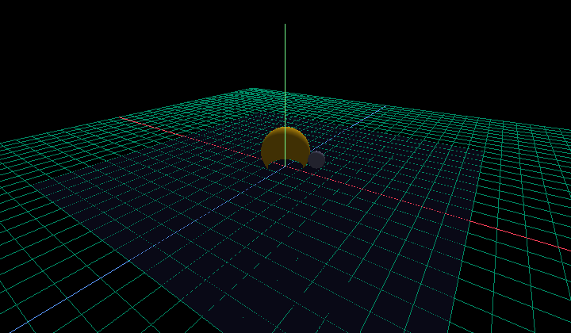
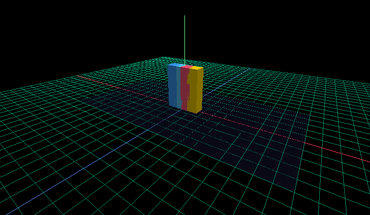
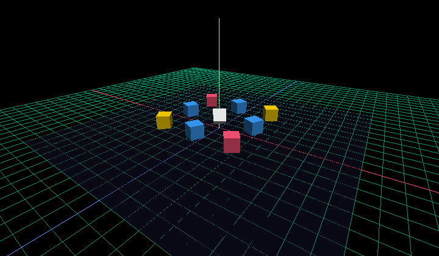
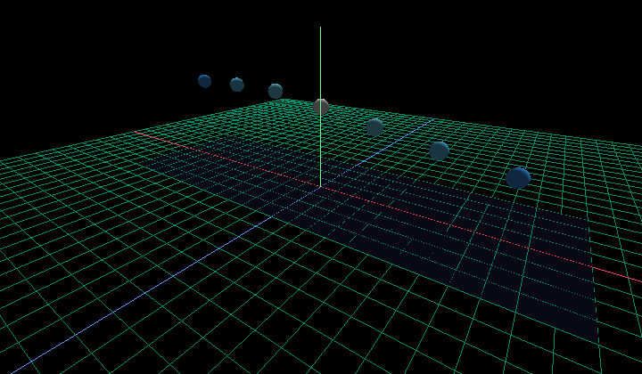
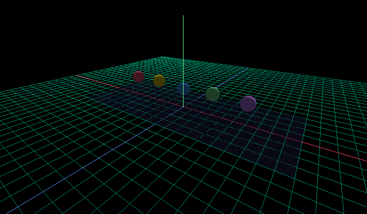
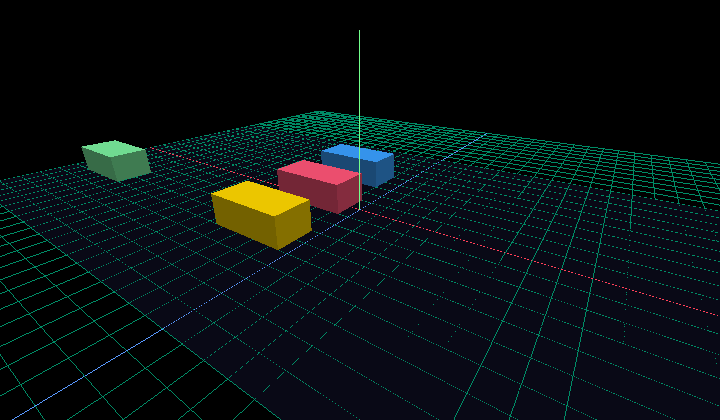

# Animated demos gallery

Six short scenes showcasing the v0.3 animation system. Each demo is a
single `.crl` file under `examples/anim/`. They render live with
`circlelib run` and encode to MP4 with `circlelib record`.

The screenshots below are rendered at roughly the mid-point of each
animation. To see the motion, run:

```sh
circlelib run examples/anim/<name>.crl
```

To export an MP4:

```sh
circlelib record examples/anim/<name>.crl --out <name>.mp4 --fps 30
```

(Falls back to a PNG sequence with `--png-fallback` when ffmpeg is
unavailable.)

---

## 1. Planet orbiting a sun

`examples/anim/orbit.crl` — a planet sweeps across the scene with
`ease_in_out` while both the planet and the sun shift color.



```crl
animate {
    duration = 6
    planet.position = anim(t, (6, 1, 0), (-6, 1, 0), 6, easing=ease_in_out)
    planet.color    = anim(t, (0.23, 0.63, 1.0), (1.0, 0.4, 0.27), 6)
    sun.color       = anim(t, (1.0, 0.84, 0.0), (1.0, 0.55, 0.2), 6, easing=ease_in_out)
}
```

## 2. Sorting visualization (bars)

`examples/anim/bars_sort.crl` — four cubes swap pairwise to mimic the
final pass of a sort. Linear interpolation is enough to read the swap
clearly.



## 3. Matrix rotation

`examples/anim/matrix_rotation.crl` — a 3×3 grid of cubes spins around
its own Y axis. Some cubes use `ease_in_out` so neighbors tumble out
of phase.



## 4. Travelling wave

`examples/anim/sine_wave.crl` — seven spheres rise and fall with a
phase offset implemented by varying each `anim(...)` `duration`. The
result reads as a wave crest moving left to right.



## 5. Bouncing balls

`examples/anim/bouncing_balls.crl` — five balls drop onto the ground
plane with the `bounce` easing curve and slightly different durations.



## 6. Car flock

`examples/anim/car_flock.crl` — four identical car bodies driving past
on staggered timings. Each car is one labelled Cube; v0.3 animates per
labelled leaf, so the flock effect is achieved through repetition
rather than component instancing.



---

## Re-rendering the screenshots

The PNGs above are checked into `docs/gallery_screenshots/`. To
regenerate them after changing a demo:

```sh
python - <<'PY'
from pathlib import Path
from circlelib.render.offscreen import render_to_png
from circlelib.runtime.evaluator import compile_program
from circlelib.runtime.resolver import load

demos = [
    "orbit", "bars_sort", "matrix_rotation",
    "sine_wave", "bouncing_balls", "car_flock",
]
out = Path("docs/gallery_screenshots")
out.mkdir(parents=True, exist_ok=True)
for name in demos:
    scene = compile_program(load(f"examples/anim/{name}.crl"))
    t = scene.duration * 0.4 if scene.is_animated else 0.0
    render_to_png(scene(t), out / f"{name}.png", width=720, height=420)
PY
```
