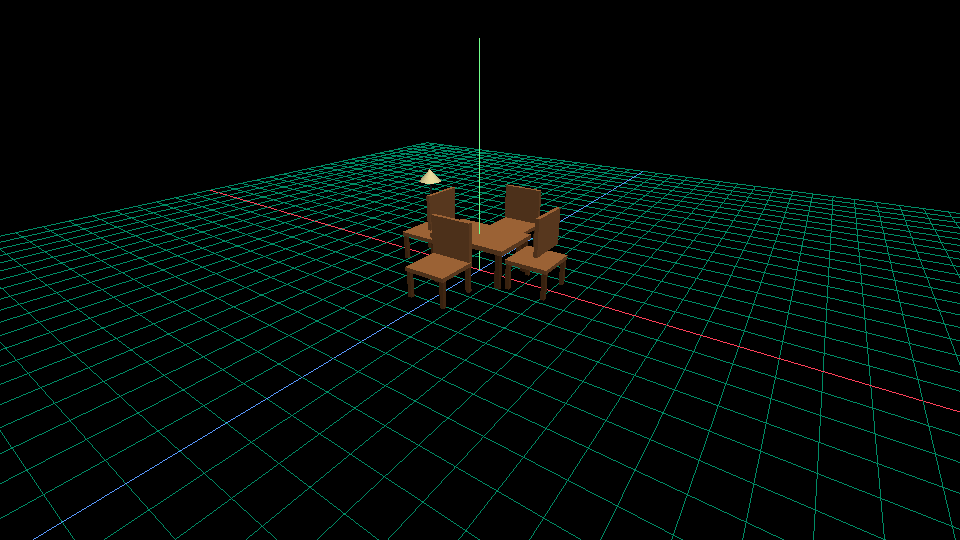
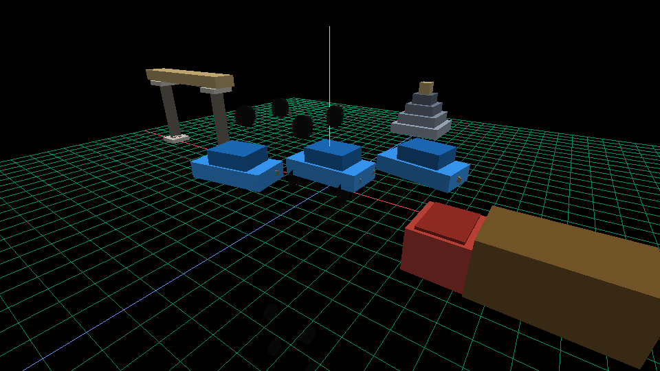
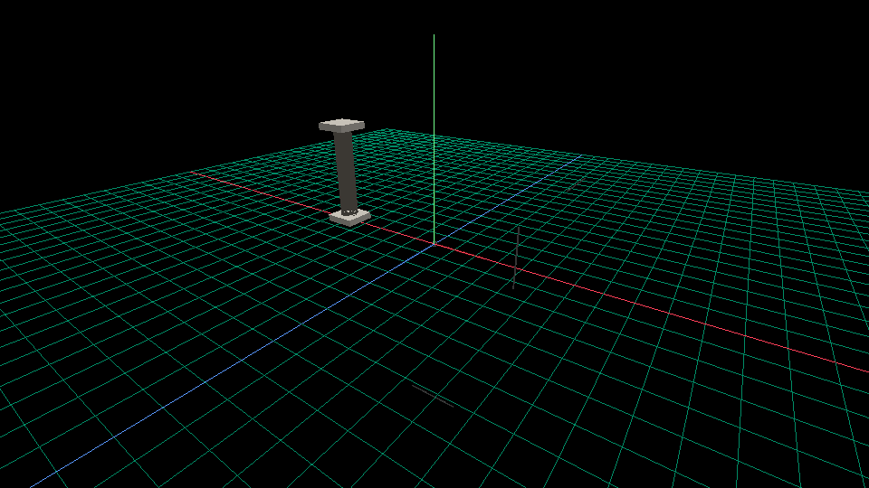

# circlelib — stdlib gallery

Three demo scenes that compose components from `@stdlib/`. Every scene
in this gallery lives under [`examples/stdlib/`](../examples/stdlib);
each render below is the static frame produced by:

```sh
circlelib run examples/stdlib/<name>.crl --export-png <name>.png --width 960 --height 540
```

## Living room

`@stdlib/furniture/chair`, `@stdlib/furniture/table`, `@stdlib/furniture/lamp`.

A small dining setup: one table, four chairs facing inward (backrests
on the outside), one floor lamp tucked off to the corner.



```crl
import "@stdlib/furniture/chair" as ch
import "@stdlib/furniture/table" as tb
import "@stdlib/furniture/lamp"  as lp

scene {
    tb.Table(position=(0, 0, 0))
    ch.Chair(position=(0, 0,  2.4), rotation=(0, 180, 0))
    ch.Chair(position=(0, 0, -2.4))
    ch.Chair(position=( 2.4, 0, 0), rotation=(0, -90, 0))
    ch.Chair(position=(-2.4, 0, 0), rotation=(0,  90, 0))
    lp.Lamp(position=(-4.5, 0, -2.5))
}
```

## Parking lot

`@stdlib/vehicles/car`, `@stdlib/structures/arch`, `@stdlib/structures/tower`.

Three cars and one truck rolling under a stone arch entrance, with a
distant landmark tower. `Car` itself imports `@stdlib/vehicles/wheels`
internally — the catalog is self-referential.



## Scene helpers

`@stdlib/geometry/axes`, `@stdlib/geometry/crosshair`, `@stdlib/structures/column`.

Orientation helpers: an `Axes` gizmo at the origin (X red, Y green,
Z blue) and a `Crosshair` floating at `(5, 2, 3)` to verify a target
position visually.


